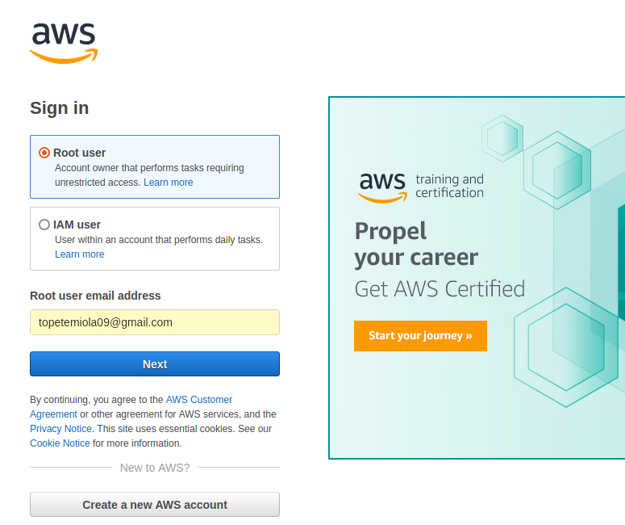
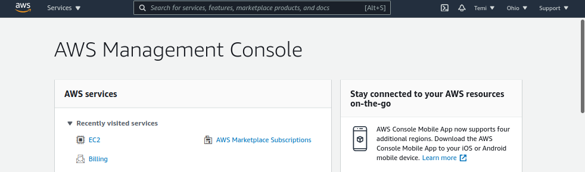
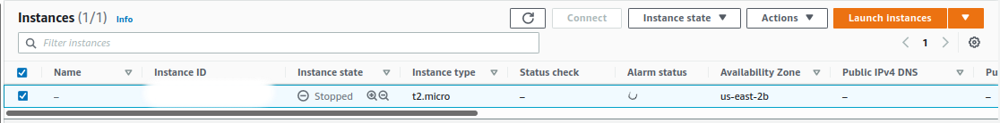
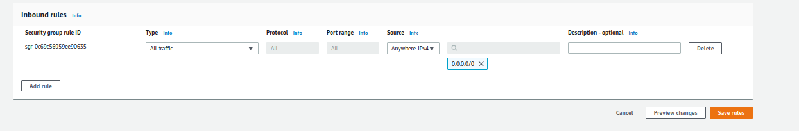
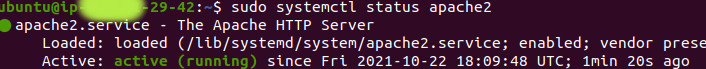
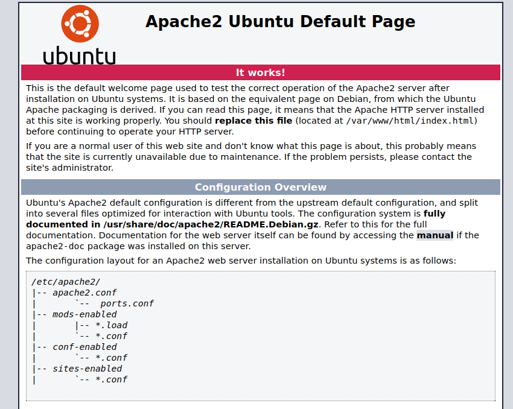
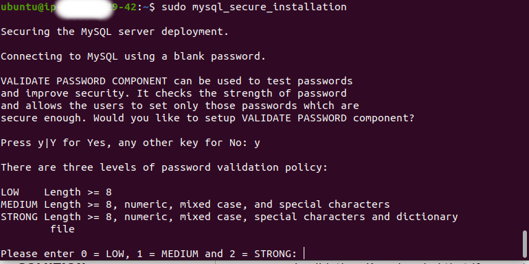
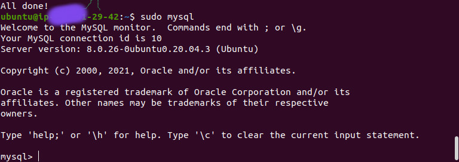
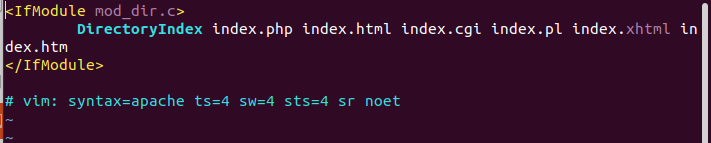
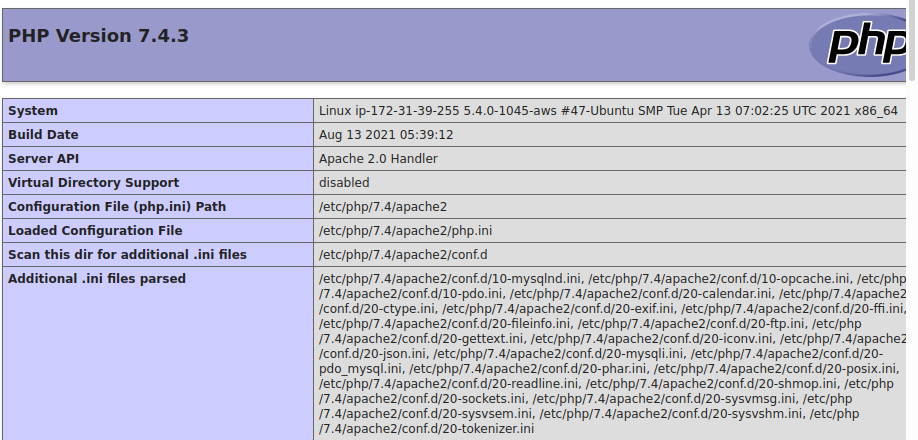

## LAMP STACK IMPLEMENTATION 
---

What is LAMP?
LAMP stands for L : Linux, A: Apache, M: mySQL, P: PHP.

These aforementiomed components or software allow to build and deliver high performance web applications. How does this work?
The LAMP stack shows how each element depends on each. Let us take an example, suppose a user sends a request to order an item from an-ecommerce store. 

The process starts off when the Apache web server recieves the requests from the web pages from a user's browser. This request is for a PHP file, The Apache server then passes the information to PHP, which then loads the file and executes the code contained in the file. 

Where does the mySQL come in; this is the database which provides the user all the necessary information about the items they intend to purchase.                               

Installation
---
The recommended way to implement LAMP, is first to create an AWS account. Using this link:
 [AWS_ACCOUNT](https://signin.aws.amazon.com/)

 The create page looks like this.

  

 After signing up, I logged into the aws account as a root user, this allowed me to have access into the aws management console, where I searched for EC2: Elastic cloud compute from the search bar, shown below.
 

Create an EC2 instance of t2.micro, requires selecting a software such as Ubuntu 20.04LTS. 

This allows for easily communication between the instance and my local machine.  
After setting up ec2 instance, the dashboard was similar to the figure below:
 

 The next step before installing LAMP is to ensure my local machine and the remote server communicate successfully, I had to download the keypair usually attached to the instance of ec2, This allows for easy communication between my local machine and the remote server. This was done using the terminal, the code required is usually in the SSH Client section in the aws management console dashboard. 
 
 During configuration, I noticed that the SSH Client link used to connect the server to my local machine did not work, this was because the default security group earlier created was set to custom, which does not allow connection to established between my local machine and ec2 instance created.
 I had to change the inbound rules from the security section in my aws management console 

After the successful configuration of aws ec2 instance with my local terminal, I proceed to installing apache. 
### APACHE INSTALLATION
To install apache, the ubuntu packages must be up to date. The terminal on my local machine was usedd for all configuration. To update apache, first i had to run this code.

`:~$ sudo apt update` .

`:~$ sudo apt install apache2` .

To check APACHE status from the local machine terminal. use this code:

`:~$ sudo systemctl status apache2 ` .
Figure below shows apache2 is active

To access the website remotely and find the ip address of the server,  I used the code

`:~$ curl -s http://169.254.169.254/latest/meta-data/public-ipv4` .

The ip address was used to launch the website. 
Screenshot below

### MYSQL INSTALLATION
The installation of mysql database makes storing and retrieving data seemsless. 
mySQL is called a relational database simply because the tabular data are structured and have a relationship with each column or row in the data.

To install mySQL, i used this command 

`:~$ sudo apt install mysql-server` .

To secure the mySQL, i had to run a security script; which is usually pre-installed with mySQL. This is done to remove some insecure default settings. The script will ensure that insecure access to the Database is prevented. 
The following command was passed into the interactive terminal.

`:~$ sudo mysql_secure_installation`

Secure the mysQL

Check if the mySQL is correctly installed.

To navigated into the mySQL databases, I used this command:

`:~$ sudo mysql` .

### PHP INSTALLATION
To install PHP which serves has the component that will process code to display dynamic content to the end user. I installed the php-mysql module to establish a connection between PHP and mySQL-based databases. There is a need to ensure that APACHE can handle PHP file, this is done using libapache2-mod-php module. It is actually possible to install the three packages using a single line of code.

`:~$ sudo apt install php libapache2-mod-php php-mysql`.

To confirm if the php is installed, i used this code
`:~$: php -v`.

After the installation of LAMP, to provide a virutal host for your website using apache server. The first step is to create a directory to serve documents. By default Apache has a default directory and the setup was not changed. 

I created a directory using the `mkdir` command as follows:

`:~$ sudo mkdir /var/www/projectlamp`.

I claimed ownership of this directory by running this command:

`:~$ sudo chown -R $USER:$USER /var/www/projectlamp` .

Next, I created an open confguration file in Apache's sites-available directory. 

`:~$ sudo vi /etc/apache2/sites-available/projectlamp.conf`.

### Creating Virtual Configuration
Apache uses a server block to serve documents in html directories. But in order not to interfere with the inbuilt setting in Apache-aws server. . 
I created a directory and claimed the ownership of it. I used the following code.

`:~$ sudo mkdir /var/www/projectlamp`.

`:~$ sudo chown -R $USER:$USER /var/www/projectlamp`.

To create a virtual host, so the apache can serve the html requests to a user, I enabled a new virtual host using the a2ensite command.

`:~$ sudo a2ensite projectlamp`.

I ensured that the default website installed on Apache Server is deactived, since  I do not own a custom domain name and Apache default configuration does overwrite the virtual host, if this is not done. To deactivate the website, I used this command.
`:~$ sudo a2dissite 000-default`

To make sure my configuration does not contain syntax errors, I ran this command

`:~$ sudo apache2ctl configtest` .

To ascertain that Apache has made the requested changes, I used this command.

`:~$ sudo systemctl reload apache2` .

But, notice that the webroot folder created is empty. I had to create an index.html file to test run the virtual host to confirm it works, with this line of code.

`:~$ sudo echo 'Hello LAMP from hostname' $(curl -s http://169.254.169.254/latest/meta-data/public-hostname) 'with public IP' $(curl -s http://169.254.169.254/latest/meta-data/public-ipv4) > /var/www/projectlamp/index.html`

.jpg)

After, creating html file I ensured that the html was displaying as shown in the screenshot. I then proceed to install PHP

### PHP INSTALLATION

To install php, the directoryIndedx settings must be changed to allow the index.php file take precedence, I used a text editor such as nano or vim to edit the configuration. I ran this command

`:~$ nano /etc/apache2/mods-enabled/dir.conf`

I had to reload apache to effect the change,using this command:

`:~$ sudo systemctl reload apache2`

To test that php is correctly installed on the server, I created a new file with a php extension in the folder(/var/www/projectlamp) earlier created, and used a text editor such as nano to write a program which gives information about php.

### LESSON LEARNT

1.  Avoid deleting folders such as the ETC Folder.

2. For any reason a folder is deleted it can be recovered using testdisk package

3. Recovery of folders introduce disk corruption such as Bad Blocks in file systems.  

4. If you must delete make sure, the data is properly backed up