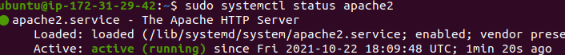
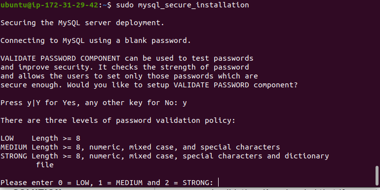
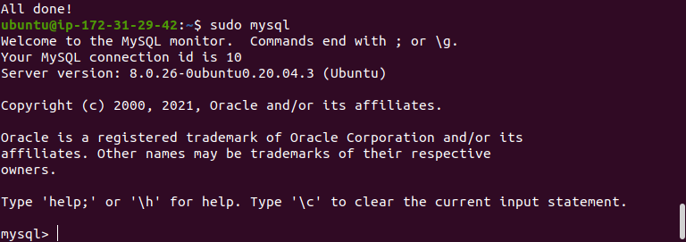

## LAMP STACK IMPLEMENTATION 
---

What is LAMP?
LAMP stands for L : Linux, A: Apache, M: mySQL, P: PHP.

These aforementiomed components or software allow to build and deliver high performance web applications. How it works?
The LAMP stack shows how each element depends on each. Let us take an example, suppose a user sends a request to order an item from an-ecommerce store. 

The process starts off when the Apache web server recieves the requests from the web pages from a typical use's browser. This request is for a PHP file, The Apache server then passes the information to PHP, which then loads the file and executes the code contained the file. 

Where does the mySQL come in; this is the database which provides the user all the necessary information about the items they intend to purchase.                               

Installation
---
The recommended way to implement LAMP, is first to create an AWS account. Using this link:
 [AWS_ACCOUNT](https://signin.aws.amazon.com/)

 The create page looks like this.

  

 After signing up, I logged into the aws account as a root user, this allowed me to have access into the aws management console, where I searched for EC2: Elastic cloud compute from the search bar, shown below.
 

Create an EC2 instance of t2.micro, requires selecting a software such as Ubuntu 20.04LTS. 

This allows for easily communication between the instance and my local machine.  
After setting up ec2 instance, the dashboard was similar to the figure below:
 

 The next step before installing LAMP is to ensure my local machine and the remote server communicate successfully, I had to download the keypair usually attached to the instance of ec2, This allows for easy communication between my local machine and the remote server. This was done using the terminal, the code required is usually in the SSH Client section in the dashboard. 

### APACHE INSTALLATION
To install apache, the ubuntu packages must be up to date using the code below usually done inside the terminal.

`~$: sudo apt install apache2`

To check APACHE status from the local machine terminal. use this code:

`~$: sudo systemctl status apache2 `
Figure below shows apache2 is active

To access the website remotely and find the ip address of the server,  I used the code

` ~$: curl -s http://169.254.169.254/latest/meta-data/public-ipv4`

The ip address was used to launch the website. 
Screenshot below

### MYSQL INSTALLATION
The installation of mysql database makes storing and retrieving data seemsless. 
mySQL is called a relational database simply because the tabular data are structured and have a relationship with each column or row in the data.

To install mySQL, i used this command on the terminal.

`~$: sudo apt install mysql-server`

To secure the mySQL, i had to run a security script; which is usually pre-installed with mySQL. This is done to remove some insecure default settings. The script will ensure that insecure access to the Database is prevented. 
Thee following command was passed into the interactive terminal.

`~$: sudo mysql_secure_installation`

Secure the mysQL

Check if the mySQL is correctly installed.

To navigated into the mySQL databases, I used this command:

`~$: sudo mysql`

